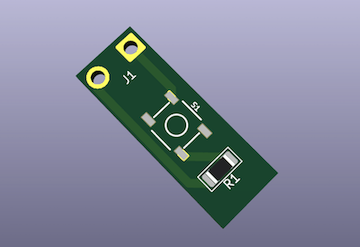
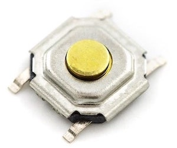
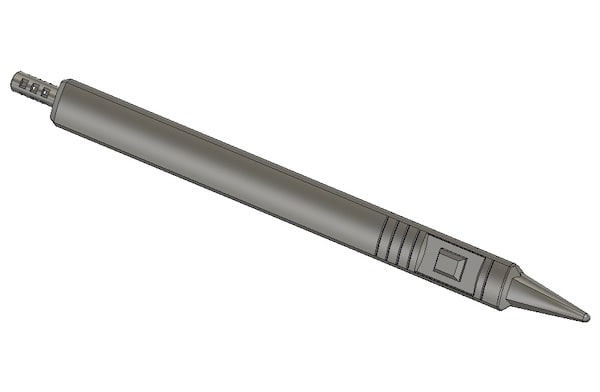
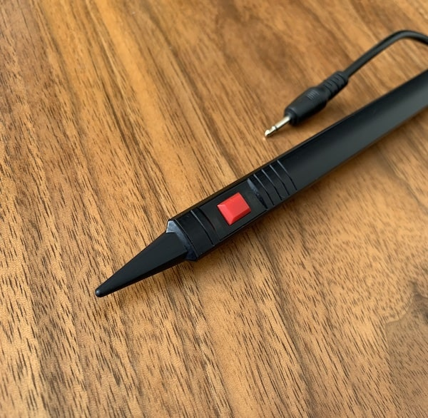
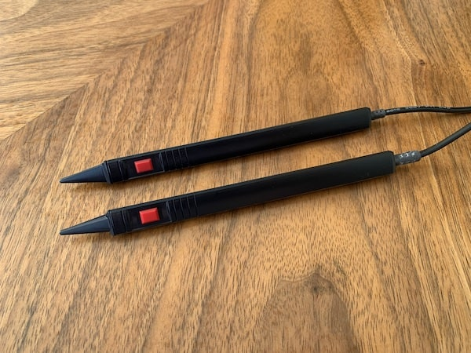
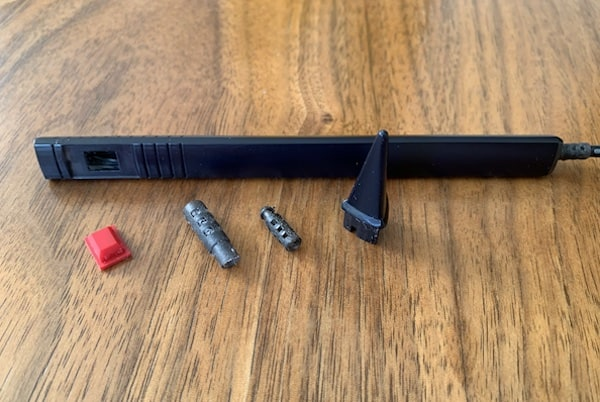
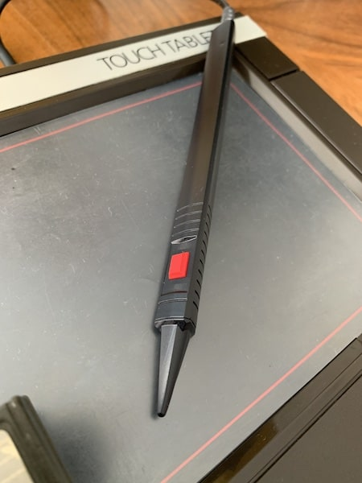
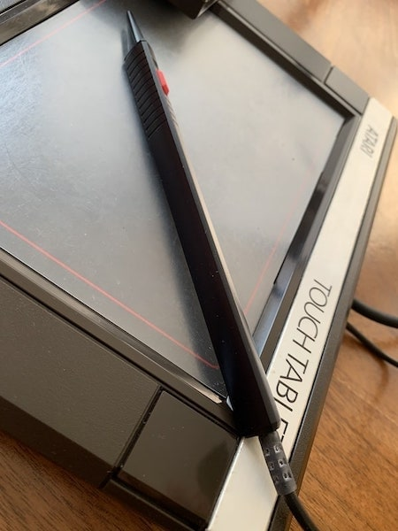
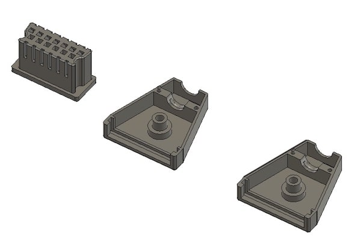
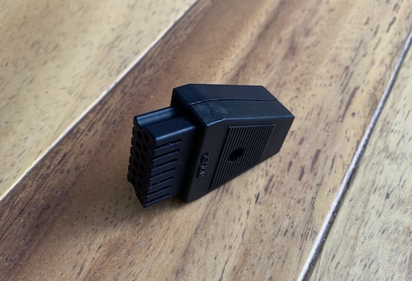

# 
Atarist

<h2>Table of Contents</h2>

+ [**- Touch Tablet CX-77**](#--touch-tablet-cx-77)
+ [**- SIO Plug**](#--sio-plug)

 

## **- [Touch Tablet CX-77](./models/touchtablet_cx_77/)**

<table cellpadding="0" cellspacing="0" width="100%">
<tr><td width="160px">

</td><td>
The ATARI Touch Tablet is an art and graphics controller designed for use with all ATARI Home Computers. You can quickly and easily create your own computer art and graphics-without writing complex programs using the AtariArtist™ software included with the Touch Tablet.

For those folks who don't have the wired-pen (stylus) of the Tablet, the following models can help to reproduce this part.

</td></tr></table>

 

>**A WORD OF APPRECIATION:**\
Special thanks to [**John Cove**](https://www.facebook.com/groups/ataristsales) who kindly provided the required data. There are more cool stuffs for retroware on his web-page [www.ataristsales.co.uk](https://www.ataristsales.co.uk).

 

**BOM:**

- Cable (2 wire) - 1pcs
- Audio jack (2.5mm) - 1pcs.
- PCB (see attached schematics):
  - SMD pushbutton switch - 1pcs (height ~1.6mm), see below.
  - 1k SMD resistor - 1pcs.

 

|  |  |
|:----:|:----:|

**NOTE:** \
The debouncing circuit is not required. 

---

**<h3>+ Photos</h3>**

|  |  |  |  |  |  |  |
|:---:|:---:|:---:|:---:|:---:|:---:|:---:|

 

## **- [SIO Plug](./models/sio_plug/)**

<table cellpadding="0" cellspacing="0" width="100%">
<tr><td width="160px">

</td><td>
The Serial Input/Output system was a proprietary peripheral bus and related software protocol stacks used on the Atari 8-bit computers to provide most input/output duties for those computers.
Printable 3D model of the most common version of MOLEX SIO plug you can download from <a href="/models/sio_plug/">here</a>.
</td></tr></table>

 

**BOM:**

- Bolt + Nut (M3) - 1pcs.

----

**<h3>+ Photos</h3>**

|  |  |  |
|:---:|:---:|:---:|

 

